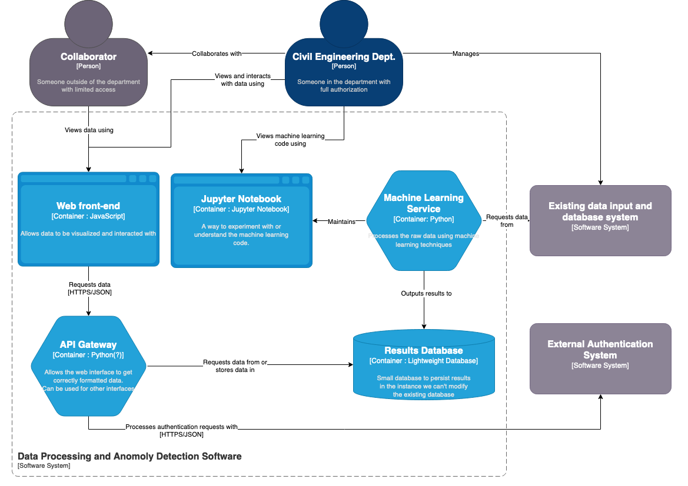

# 2021-ECMM427-project-04

### Project 04: Structural Health Monitoring of Civil Infrastructures: Machine learning for visualising and detecting anomalies from “big” structural response data

* Client: Prakash Kripakaran and Ki Koo
* Department: Engineering

# Setup
## Tools
 - [Docker](https://docs.docker.com/get-docker/)
 - [docker-compose](https://docs.docker.com/compose/install/)
 - [VSCode](https://code.visualstudio.com/download) (optional)
 - [GitKraken](https://www.gitkraken.com/download) (optional) with free Pro with [GitHub Student](https://education.github.com/pack)
 - [Apicurio](https://www.apicur.io/apicurito/pwa/) should be used to edit API contract JSON files
## File Structure
 - Each service has its own folder so they can be developed independently - each folder also represents one Docker container
 - Each folder should have a `Dockerfile` in the top level that can be utilized by docker-compose
 - The top level `docker-compose.yml` can be used to run all modules together
 - The `docker-compose.yml` file in each folder can be used to run just one module.
## Docker
 - Docker can be used alone to run each container, however it would take too long to keep track of and run every command for each service - docker-compose automates this so you just need `docker-compose up` to run the selected services.
 - Example using Docker for Python data science [here](https://towardsdatascience.com/hands-on-guide-to-docker-for-data-science-d5d1f6f4a326)

# Architecture 
